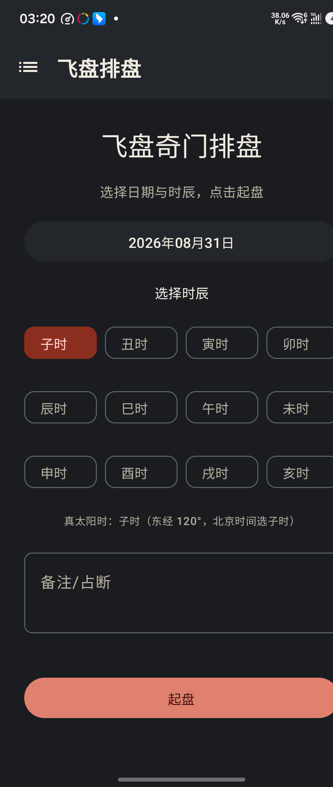
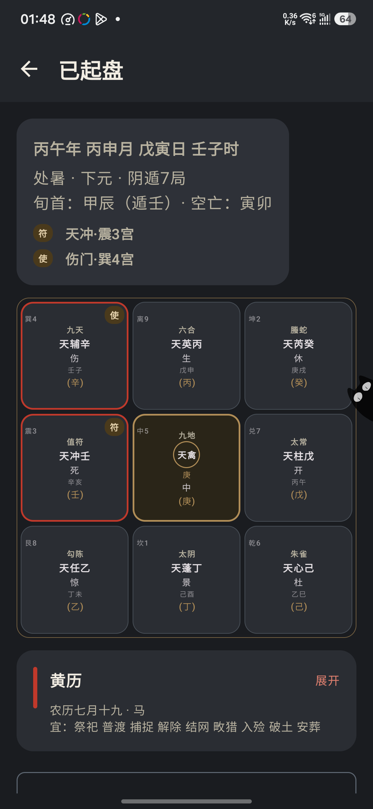
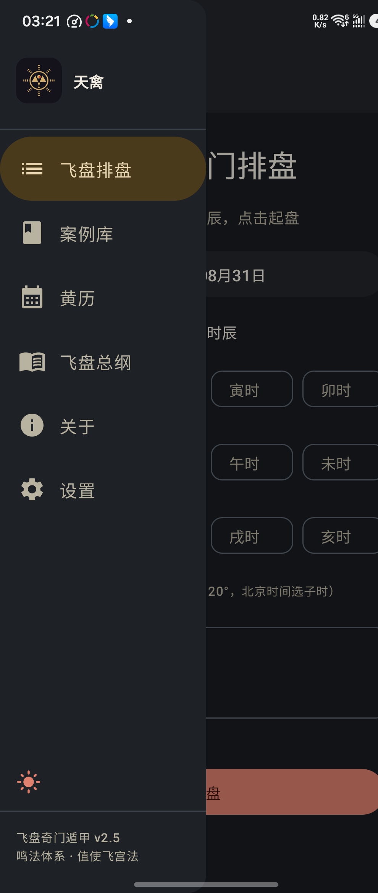
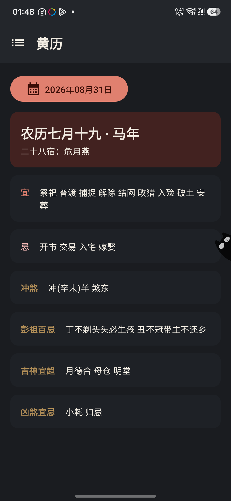
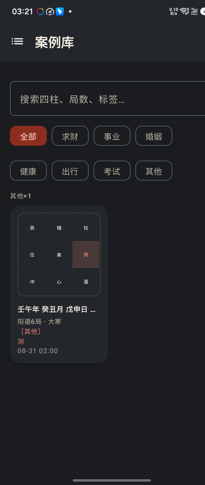
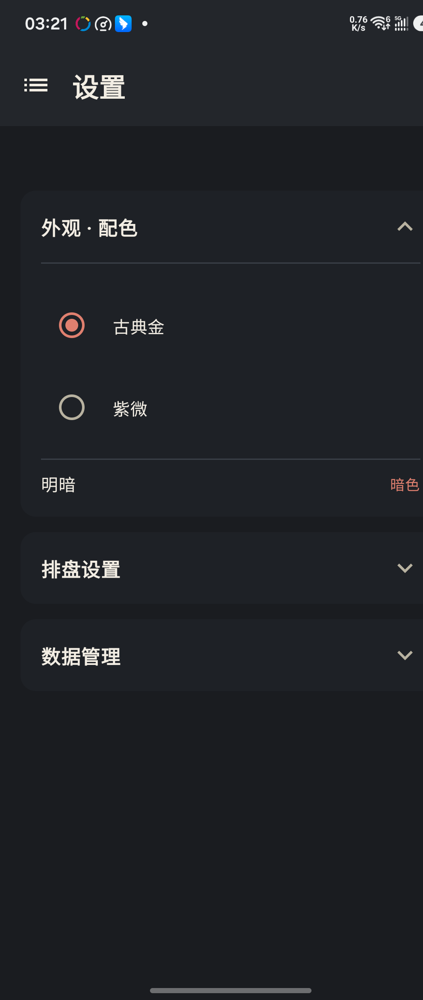

# 天禽 · 飞盘奇门排盘

🌐 **官网**：[https://potuo.github.io/](https://potuo.github.io/)

> 据《奇门基础资料 2023版教》鸣法体系的**飞盘奇门**排盘 Android App
> 鸣法体系 · 值使飞宫法 · 星门顺飞 · 符使入中

[](https://kotlinlang.org)
[](https://developer.android.com/jetpack/compose)
[](LICENSE)

飞盘奇门排盘工具，遵循《奇门基础资料 2023版教》口径：九星八门按洛书宫序顺飞、天禽中门参与飞布、符使可入中，严格实现「值使门飞宫法」与「符头地支定元」。

## ✨ 功能

- 🌀 **飞盘排盘**：定局 → 布盘 → 星门顺飞 → 暗干支，完整七步
- 🔍 **格局检测**：击刑 / 入墓 / 门迫 / 伏吟反吟 / 守门 / 空亡 / 正格干支组合，自动标注吉凶
- 🔮 **奇门演卦**：星门演卦、门宫演卦，叠成六爻卦
- ✨ **玄鉴 AI 断局**：接入大模型（DeepSeek / Kimi / 通义 / 小米 MiMo，可自定义），起盘后一键参断吉凶，含思考过程与资料 skill
- 👆 **点宫格详解**：点任意宫格，看星/门/神教材释义 + 演卦 + 奇仪六亲
- 📅 **黄历详情**：宜忌 / 冲煞 / 彭祖 / 吉神凶煞 / 二十八宿 / 公历农历节日
- 🗂️ **案例库**：事项分类 + 反馈 Tab 筛选 + 导入导出
- ☀️ **真太阳时**：经度校正，跨时辰边界自动提示
- ⏱️ **时辰对比**：起盘后一键切换前后时辰
- 📤 **盘面分享**：一键生成分享图（含朱砂印章落款）
- 📖 **飞盘总纲**：内置教材《奇门基础资料 2023版教》三卷
- 🎨 **五主题**：古典金 / 紫微 / 玄墨 / 青花 / 赭石 × 明暗

## 📸 截图

| 排盘输入 | 盘面结果 | 侧滑栏 |
|---|---|---|
|  |  |  |

| 黄历详情 | 案例库 | 设置 |
|---|---|---|
|  |  |  |

## 📦 下载安装

最新 APK 见 [Releases](https://github.com/potuo/feipan-qimen/releases)。

```bash
./gradlew test          # 算法单测（含校验案例）
./gradlew assembleDebug # 构建 APK
adb install -r app/build/outputs/apk/debug/app-debug.apk
```

## 📜 版本历史

- **v4.0**：玄鉴 AI 断局 + 资料 skill 系统 + 思考过程；格局卡片折叠；参断加载动画
- **v3.x**：界面古风化 + 点宫格详解 + 奇门演卦 + 正格扩充 + 时辰对比 + 五主题 + 黄历节日
- **v2.6.x**：更名「天禽」+ 八卦天禽图标；格局检测；真太阳时；盘面分享；案例分类；飞盘总纲；更新日志联网化
- **v2.5**：黄历详情页；黑白主题切换；主题收敛古典金
- **v2.4**：设置页折叠分组
- **v2.3**：框架重构为侧滑栏导航；中式古典盘面；启动动画
- **v2.0**：值使飞宫法 + 符头定元（教材口径重构）；黄历/案例库

## 📄 License

[MIT](LICENSE)
